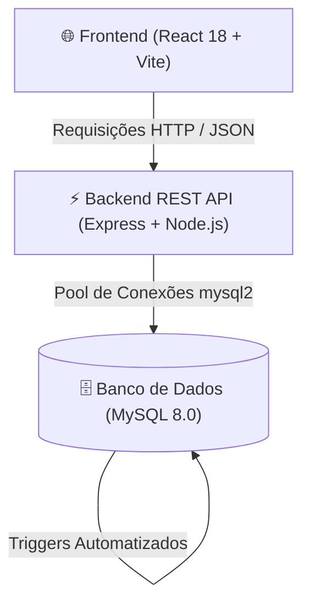

# 🎓 Gestor de Cursos - Sistema de Gestão Acadêmica Fullstack

[](https://nodejs.org/)
[](https://expressjs.com/)
[](https://react.dev/)
[](https://vitejs.dev/)
[](https://www.mysql.com/)
[](LICENSE)

Sistema completo para gestão de cursos, turmas, matrículas, lançamento de notas e histórico escolar. Desenvolvido com arquitetura desacoplada (REST API + Single Page Application) e automações nativas via **Triggers no MySQL**.

---

## 📑 Sumário

- [Visão Geral](#-visão-geral)
- [Arquitetura do Projeto](#-arquitetura-do-projeto)
- [Funcionalidades por Perfil](#-funcionalidades-por-perfil)
- [Automações no Banco de Dados (Triggers)](#-automações-no-banco-de-dados-triggers)
- [Controle de Acesso por Bitmask](#-controle-de-acesso-por-bitmask)
- [Estrutura de Diretórios](#-estrutura-de-diretórios)
- [Guia de Instalação e Execução](#-guia-de-instalação-e-execução)
- [Contas de Teste Pré-configuradas](#-contas-de-teste-pré-configuradas)

---

## 🌟 Visão Geral

O **Gestor de Cursos** organiza todo o fluxo acadêmico de uma instituição de ensino:
- **Alunos** podem visualizar turmas com vagas abertas, solicitar matrícula, consultar notas parciais (P1, P2, PF, Média Final) e acessar seu histórico escolar.
- **Professores** têm painel dedicado para gerenciar suas turmas e lançar notas em tempo real.
- **Administradores** controlam usuários, atribuem múltiplos papéis através de bitmask, criam períodos letivos, cadastram cursos e abrem/fecham turmas.

---

## 🏗️ Arquitetura do Projeto



- **Frontend**: SPA construída com React 18, React Router v7, Context API para autenticação e Vite para build ultrarrápido.
- **Backend**: API RESTful em Express estruturada no padrão MVC (Routes -> Controllers -> Services -> Database Pool), com hashing seguro de senhas via `bcryptjs` e variáveis de ambiente via `dotenv`.
- **Database**: Modelagem relacional 3NF no MySQL 8 com procedures e triggers para cálculo autônomo de médias e gestão da fila de vagas.

---

## 👥 Funcionalidades por Perfil

### 🎓 Portal do Aluno
- **Disciplinas em Andamento**: Lista de turmas matriculadas, professor responsável e notas das avaliações (P1, P2, PF, Média Final).
- **Inscrição em Turmas**: Visualização de turmas com inscrições abertas e solicitação de vaga com 1 clique.
- **Histórico Acadêmico**: Registro permanente com resultado (Aprovado / Reprovado), média final e data de encerramento da disciplina.

### 👨‍🏫 Portal do Professor
- **Painel de Turmas**: Visualização de todas as turmas sob sua responsabilidade no período letivo.
- **Lançamento de Notas**: Tabela interativa para lançamento de `P1`, `P2` e `PF`.
- **Cálculo Automático**: Ao salvar as notas, o gatilho no banco recalcula imediatamente a média e atualiza a situação do estudante.

### 🛡️ Portal Administrativo
- **Gestão de Usuários**: Cadastro de novos alunos/docentes e alteração de papéis em tempo real.
- **Gestão de Cursos**: Criação e monitoramento da carga horária de cursos da instituição.
- **Gestão de Períodos Letivos**: Abertura de semestres letivos e desativação programada.
- **Processamento de Inscrições**: Abertura e fechamento de turmas com disparo automático da distribuição de vagas regulares e excedentes.

---

## ⚡ Automações no Banco de Dados (Triggers)

O banco de dados não apenas armazena dados, mas executa ativamente as regras de negócio:

| Trigger | Tabela Alvo | Comportamento |
| :--- | :--- | :--- |
| `trg_calcula_media` | `aluno_curso` | Calcula automaticamente se o aluno foi aprovado direto ($\ge 7.0$), se precisa de prova final, ou se foi reprovado. Em caso de aprovação/reprovação final, registra automaticamente no `historico_aluno`. |
| `trg_processa_inscricoes_turma` | `turma` | Ao fechar as inscrições (`status_inscricoes = 'fechada'`), prioriza os inscritos por tentativas anteriores e ordem de chegada, aprovando as vagas regulares e gerando as matrículas em `aluno_curso`. |
| `trg_periodo_desativa` | `periodo` | Desativa em cascata todas as turmas de um período letivo quando ele é encerrado. |
| `chk_resposta_atividade` | `resposta_atividade` | Verifica se o aluno pertence à turma da atividade e valida prazos, marcando entregas atrasadas. |

---

## 🎭 Controle de Acesso por Bitmask

O campo `usuario.tipo` utiliza uma máscara de bits para suportar múltiplos papéis em um único inteiro:

$$\text{Papel} = (\text{tipo} \ \& \ \text{máscara}) \neq 0$$

- `1` (`001` em binário) $\rightarrow$ **Aluno**
- `2` (`010` em binário) $\rightarrow$ **Professor**
- `4` (`100` em binário) $\rightarrow$ **Administrador**
- `3` (`011` em binário) $\rightarrow$ **Aluno e Professor simultaneamente**
- `7` (`111` em binário) $\rightarrow$ **Acesso Total (Aluno, Professor e Administrador)**

---

## 📁 Estrutura de Diretórios

```
Bd-main/
├── backend/                       # API REST em Node.js / Express
│   ├── .env.example               # Exemplo de configuração de ambiente
│   ├── package.json               # Dependências do backend (express, bcryptjs, mysql2)
│   └── src/
│       ├── config/database.js     # Pool de conexão MySQL
│       ├── controller/            # Controladores da API
│       ├── routes/                # Rotas modularizadas
│       └── services/              # Regras de negócio e consultas SQL
├── frontend/                      # SPA em React + Vite
│   ├── package.json               # Dependências do frontend
│   ├── vite.config.js             # Configuração do Vite
│   └── src/
│       ├── context/AuthContext.jsx # Contexto de autenticação e sessão
│       └── pages/                 # Páginas (Login, Aluno, Professor, Admin, Home)
├── database/
│   ├── schema.sql                 # DDL, triggers e dados iniciais (seed)
│   └── README.md                  # Documentação específica do banco de dados
├── package.json                   # Scripts monorepo raiz (concurrently)
└── README.md                      # Documentação principal
```

---

## 🚀 Guia de Instalação e Execução

### Pré-requisitos
- [Node.js](https://nodejs.org/) (v18 ou superior)
- [MySQL Server](https://dev.mysql.com/downloads/mysql/) (v8.0 ou superior)

### 1. Clonar o Repositório
```bash
git clone https://github.com/seu-usuario/gestor-de-cursos.git
cd gestor-de-cursos
```

### 2. Configurar o Banco de Dados
Certifique-se de que o serviço do MySQL está em execução e importe o arquivo de esquema:
```bash
# Windows (PowerShell)
Start-Service MySQL80
mysql -u root -p < database/schema.sql

# Linux / macOS
mysql -u root -p < database/schema.sql
```

### 3. Configurar Variáveis de Ambiente
No diretório `backend/`, crie o arquivo `.env` a partir do modelo:
```bash
cp backend/.env.example backend/.env
```
Edite o arquivo `backend/.env` caso a senha ou usuário do seu MySQL sejam diferentes:
```env
PORT=3001
DB_HOST=localhost
DB_USER=root
DB_PASS=sua_senha
DB_NAME=gestorDeCursos
DB_PORT=3306
```

### 4. Instalar as Dependências
Execute na raiz do projeto:
```bash
npm run install:all
```

### 5. Iniciar a Aplicação
Inicie tanto a API quanto o Frontend simultaneamente com um único comando na raiz:
```bash
npm run dev
```

- **Backend API**: `http://localhost:3001`
- **Frontend SPA**: `http://localhost:5173`

---

## 🔑 Contas de Teste Pré-configuradas

O banco de dados já inicializa com usuários de demonstração para cada perfil. Na tela de login há botões de **preenchimento rápido em 1 clique**:

| Perfil | CPF | Senha | Acesso / Permissões |
| :--- | :--- | :--- | :--- |
| 🛡️ **Administrador** | `00000000000` | `admin123` | Acesso ao Painel Administrativo (`/admin`) |
| 👨‍🏫 **Professor** | `11111111111` | `prof123` | Acesso ao Portal do Professor (`/professor`) |
| 🎓 **Aluno** | `22222222222` | `aluno123` | Acesso ao Portal do Aluno (`/aluno`) |

---

## 📄 Licença

Distribuído sob a licença MIT. Consulte `LICENSE` para mais detalhes.
